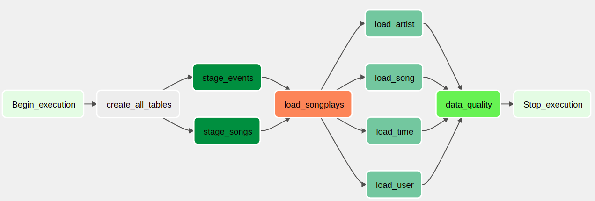

# Overview

A music streaming company, Sparkify, has decided that it is time to introduce
more automation and monitoring to their data warehouse ETL pipelines and come to
the conclusion that the best tool to achieve this is Apache Airflow.

As a data engineer, they expect me to create high grade data pipelines that are
dynamic and built from reusable tasks, can be monitored, and allow easy backfills.
They have also noted that the data quality plays a big part when analyses are
executed on top the data warehouse and want to run tests against their datasets
after the ETL steps have been executed to catch any discrepancies in the datasets.

The source data resides in S3 and needs to be processed in Sparkify's data
warehouse in Amazon Redshift. The source datasets consist of JSON logs that tell
about user activity in the application and JSON metadata about the songs the
users listen to.

In this project, I'll be focusing on configuring airflow environment, creating
and designing dag to automate and controle the pipeline workflow. I'll create
all the necessary tasks for the whole data pipeline.

This [link](https://github.com/mdifils/Data-Warehouse-Redshift) is my previous
project in case you want more details on building data pipeline.

# Project structure

|        File/Folder        |                       Description                       |
| :-----------------------: | :-----------------------------------------------------: |
|   Data-Pipeline-Airflow   |                    working directory                    |
|    docker-compose.yaml    |  airflow scheduler, webserver, triggerer configuration  |
| default_security_group.sh |        check default security group permissions         |
|    add_inbound_rule.sh    |            Allow airflow to access redshift             |
|    launch_redshift.sh     |          Create and configure redshift cluster          |
|    redshift_status.sh     |              Check redshift cluster status              |
|    delete_redshift.sh     |                 delete redshift cluster                 |
|     check_clusters.sh     |         check description of redshift clusters          |
|    airflow_pipeline.py    |  main script that contains dag and tasks configuration  |
|     create_tables.sql     |            SQL queries to create all tables             |
|      sql_queries.py       |   ETL to load fact and dim tables plus quality checks   |
|     stage_redshift.py     | module for custom operator to stage data into redshift  |
|       load_fact.py        | module for custom operator to load data into fact table |
|     load_dimension.py     | module for custom operator to load data into dim table  |
|      data_quality.py      |    module for custom operator to check data quality     |

The purpose for this project is to implement the following dag design:

# Quickstart

## Requirements

- docker
- docker-compose
- AWS account and IAM user with ACCESS_KEY_ID and ACCESS_SECRET_KEY
- AWS CLI ([installation and configuration](https://docs.aws.amazon.com/cli/latest/userguide/getting-started-install.html))

**Note**: Airflow [version 2.2.4](https://airflow.apache.org/docs/apache-airflow/stable/start/docker.html)
will be used for this project and will be running using docker. So be aware that
some modules, APIs, etc ... have been deprecated. For Windows users, I recommend
working on Windows Subsystem for Linux (WSL).  
The `docker-compose.yaml` file has been downloaded from airflow website
(link above) and customized for this project.

1. Clone this repository: `git clone https://github.com/mdifils/Data-Pipeline-Airflow.git`
2. Change directory: `cd Data-Pipeline-Airflow`
3. Setting the right Airflow user: `echo -e "AIRFLOW_UID=$(id -u)" > .env`
4. Initialize the database for airflow metadata: `docker-compose up airflow-init`

5. Running Airflow: `docker-compose up -d`
6. Check Airflow containers and wait for healthy status: `docker-compose ps`

7. Go to your browser and type: `http://localhost:8080`

Login an password are: **airflow**.  
Make sure that `.sh` files are executable (otherwise use `chmod u+x <file.sh>`)

8. Launch redshift cluster: `./launch_redshift.sh`
9. Check redshift status and wait (around 3 minutes) until it is **available**: `./redshift_status.sh`

Copy redshift endpoint:

10. Check the default security group permissions: `./default_security_group.sh`

11. Allow Airflow to access redshift cluster: `./add_inbound_rule.sh`

12. Add AWS credentials to Airflow

12. Add Redshift credentials to Airflow

13. We can now run our Airflow-pipeline DAG on Airflow UI

